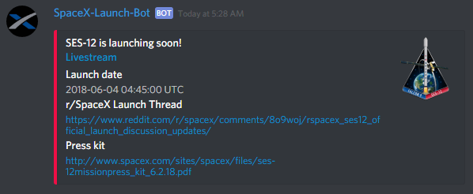

    
    

A Discord bot for providing news and information about upcoming SpaceX launches. The bot also provides a notification service for updating you with the latest launch information, and reminders for launches that will be happening soon

## Usage

A launch information message shows detailed information about the next upcoming launch. This is sent through the notification service as well as when the `!nextlaunch` command is used

A launch notification message that provides useful links to things such as the livestream and press kit. This message is only sent through the notification service (more details below)

## Commands

Command|Description|Permissions needed
---|---|---
`!nextlaunch`|Send the latest launch information message to the current channel|None
`!addchannel`|Add the current channel to the launch notification service|Admin
`!removechannel`|Remove the current channel from the launch notification service|Admin
`!addping @role`|Add roles/users to be pinged when the "launching soon" (launch notification) message is sent. Can be formatted with multiple mentions in any order, like this: `!addping @role1 @user1 @role2`. Calling `!addping` multiple times will not stack the roles, it will just overwrite your previous settings|Admin
`!removeping`|Stop any roles/users on the server being pinged when the "launching soon" (launch notification) message is sent|Admin
`!info`|Show information about the bot|None
`!help`|List these commands|None

## Launch notification service

The `!addchannel` command allows admins to "subscribe" text channels to the bots notification service

This means the bot will send a new launch information message to the subscribed channel every time the next upcoming launch has changed, e.g. if a launch date is changed or if a launch just happened so now the next upcoming launch is different

A launch notification message will be sent around 15 minutes (not exact, due to technical reasons) before a launch actually happens

---

## Planned Updates / Improvments

- Make this readme better (easier to read, understand, etc.)
- Allow more per-server settings (such as prefix, types of notifs, etc.)
- Improve `info` command (more info, better formatting)
- Add a voting command or some way of insetivising / integrating DBL voting
- Generally clean up code
    + Clean up `/modules`, seperate into more meaningful dirs
    + Store settings, data, etc. in objects instead of dicts (where appropriate)
- "Allowing a mention as the prefix ("@MyBot help") or adding a way to find the bot's prefix with only a mention ("@MyBot" or "@MyBot, what's your prefix?") will help users who are new to your bot in getting started. (Make sure that whatever the message is, it's easily found. A great way to do this is by including it in your bot's presence.)"
- Complete in-code TODOs
