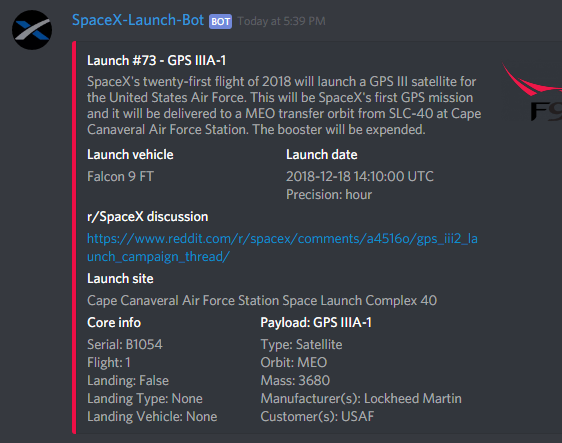
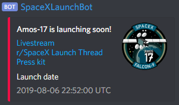

<h1 align="center" style="font-weight: bold">SpaceX Launch Bot</h1>

    
    
    
     
    
    
        

A Discord bot for getting news, information, and notifications about upcoming SpaceX launches. The notification service updates you with the latest launch information and reminders for launches that will be happening soon.

## Commands

Command|Description|Permissions needed
---|---|---
`!nextlaunch`|Send the latest launch information message to the current channel|None
`!addchannel`|Add the current channel to the notification service|Admin
`!removechannel`|Remove the current channel from the notification service|Admin
`!setmentions @mention`|Set roles/users to be mentioned when a "launching soon" message is sent. Can be formatted with multiple mentions in any order, like this: `!setmentions @role1 @user1 @role2`. Calling `!setmentions` multiple times will not stack the roles, it will just overwrite your previous mentions|Admin
`!removementions`|Remove all mentions set for the current guild|Admin
`!getmentions`|Get mentions set for the current guild|Admin
`!info`|Show information about the bot|None
`!help`|List these commands|None

## Notifications

The `!addchannel` command allows admins to "subscribe" text channels to the bots notification service. This will send the subscribed channel different types of messages, which are explained below.

- A **launch information message** shows detailed information about the next upcoming launch. This message is sent every time the next upcoming launch has changed, e.g. if a launch date is changed or if a launch just happened so now the next upcoming launch is different. Currently the bot checks for changes every 15 minutes.

- A **launching soon message** provides useful links to things such as the livestream and press kit. This message is only sent through the notification service and will be sent roughly 15 minutes (not exact due to technical reasons) before a launch actually happens.

## New Features

I am currently using a Trello board to keep track of new features, todos, etc.

You can see it [here](https://trello.com/b/5zLV8wR3/spacexlaunchbot)
