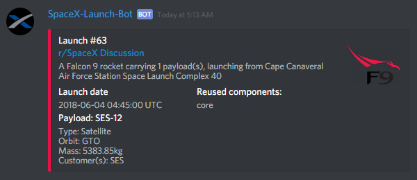
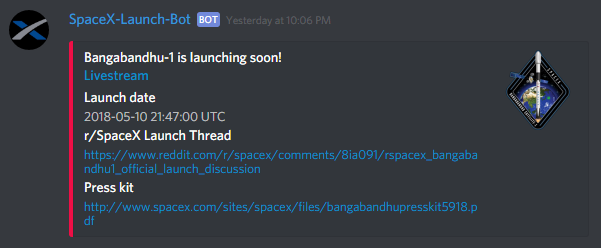

A Discord bot for providing news and information about upcoming SpaceX launches.

Also provides a notification service for launch information and reminders for launches happening soon

<b><a href="https://discordapp.com/oauth2/authorize?client_id=411618411169447950&scope=bot&permissions=248896">Add this bot to your server</a> | <a href="https://discordbots.org/bot/411618411169447950">View on discordbots.org</a></b>

# What does this bot do?

 - Allow users to see information about the next upcoming launch
 - Allows admins to "subscribe" channels to the bots launch notification service. This service will send a new message to the channel every time the next upcoming launch has changed (e.g. if a launch date is changed or if a launch just happened so now the next upcoming launch is different). A notification will also be sent around half an hour before a launch, containing useful links such as the livestream and the press kit

Launch Info:
 

Launch Notification:
 

# Commands

Each command requires a prefix (the default is "!"), this can be changed by editing `PREFIX = "!"` in `main.py` to whatever you want

 - `!nextlaunch` - Show info about the next upcoming launch - any user can use this command
 - `!addchannel` - Add the current channel to the bots launch notification service - only admins can use this command
 - `!removechannel` - Remove the current channel to the bots launch notification service - only admins can use this command
 - `!info` - Information about the bot - any user can use this command
 - `!help` - List these commands - any user can use this command
 
 # Technical Info
 
 The API used is the [r/Space-X API](https://github.com/r-spacex/SpaceX-API)

# ToDo

 - Show in new launch info notifications what has changed since the last launch info embed, e.g. if just the date has changed or if it is a new launch #
